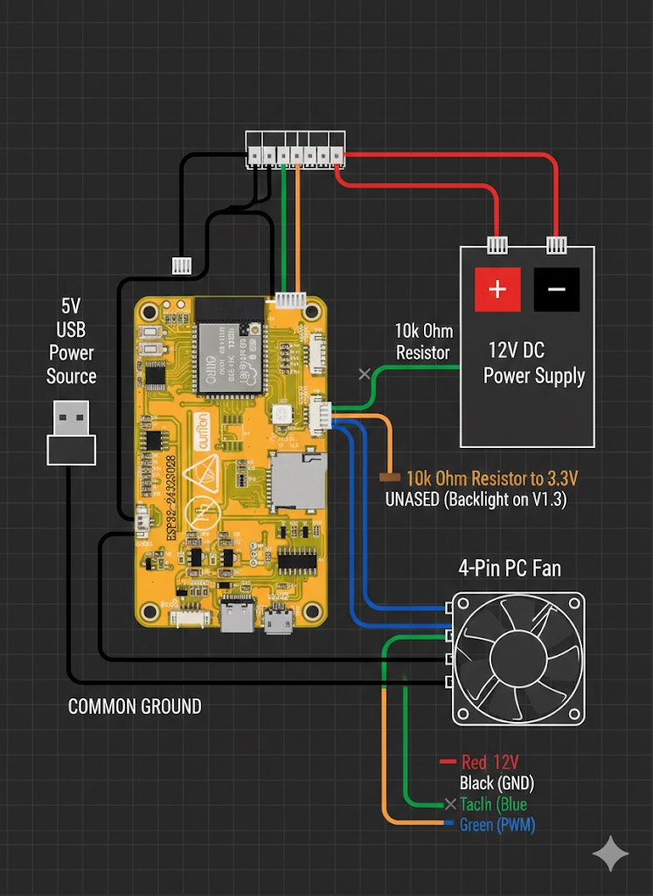

# 🖥️ ESP32 CYD Touch Dashboard
### ESP32-Powered Server Rack Monitor & Fan Controller


**SkyNet** is a comprehensive monitoring solution for home server enthusiasts. Built using **ESPHome** and the **LVGL (Light and Versatile Graphics Library)**, it transforms a "Cheap Yellow Display" (CYD) into a tactical command center for your server rack.

---

## ✨ Key Features

* **Multi-Page UI**: Dedicated views for Home, Home Assistant host metrics, SkyNAS health, Rack Environmentals, and Fan Control.
* **Active Hardware Control**: 
    * **PWM Fan Management**: Adjust speeds via a touch-friendly slider or incremental $+/-$ buttons.
    * **Real-time RPM Feedback**: Monitor fan tachometer pulses directly on-screen.
* **Automation & Intelligence**:
    * **Auto-Cycle Mode**: Automatically rotates through status pages every 10 seconds.
    * **Smart Backlight**: Includes a 60-second sleep timer to prevent screen burn-in, with wake-on-touch support.
* **Dynamic Visuals**: 
    * Gauge arcs change color (blue to red) when CPU or Memory usage exceeds 90%.
    * Live 4-bar Wi-Fi RSSI signal indicator in the header.

---

## 🛠️ Hardware & Wiring

To build the SkyNet dashboard, you will need an ESP32-2432S028R (CYD) and a few components for fan control.

### 📐 Wiring Diagram


> [!CAUTION]
> **Voltage Safety**: Standard PC fans require **12V**, while the ESP32 operates at **3.3V**. Always use a MOSFET or a dedicated controller for the fan's power line to avoid damaging your ESP32.

### 📍 Pin Mapping

| Component | Pin (GPIO) | Notes |
| :--- | :--- | :--- |
| **Backlight PWM** | 21 | Controls screen brightness/sleep |
| **Fan PWM Output** | 27 | Connected to Fan PWM pin |
| **Fan Tachometer** | 22 | Connected to Fan RPM pin |
| **TFT SPI** | 14 / 13 / 12 | CLK / MOSI / MISO |
| **Touch SPI** | 25 / 32 / 39 | CLK / MOSI / MISO |

---

## 🚀 Quick Start (Web Installer)

If you have enabled GitHub Pages for this repository, you can flash your device directly from your browser:

1. Connect your ESP32 to your computer via USB.
2. Visit: [https://byghtlaur.github.io/ESPHome-CYD/](https://byghtlaur.github.io/ESPHome-CYD/)
3. Click the **"Flash to Display"** button.
4. Follow the prompts to connect and install the pre-compiled `firmware.bin`.

---

## 💻 Local Installation & Customization

If you want to modify the logic or use your own entities:

1. **Clone the Repo**:
    ```bash
    git clone [https://github.com/byghtlaur/ESPHome-CYD.git](https://github.com/byghtlaur/ESPHome-CYD.git)
    ```
2. **Configure Secrets**: Create a `secrets.yaml` in the root folder:
    ```yaml
    wifi_ssid: "Your_SSID"
    wifi_password: "Your_Password"
    api_encryption_key: "Your_Key"
    ota_password: "Your_Password"
    ```
3. **Update Entities**: Edit `display.yaml` to match your Home Assistant sensor IDs.
4. **Deploy**:
    ```bash
    esphome run display.yaml
    ```

---

## 📂 Project Structure

* `display.yaml`: The core ESPHome configuration and LVGL logic.
* `index.html`: Web-based flash installer for GitHub Pages.
* `manifest.json`: Metadata for the ESP-Web-Tools installer.
* `firmware.bin`: Pre-compiled binary for immediate deployment.

---

## 🤝 Contributing
Feel free to fork this project, submit PRs, or report issues. I'm always looking to add more pages (like UPS monitoring or Network throughput)!

---
*Created with ❤️ by byghtlaur*
